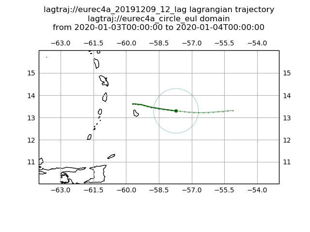

# lagtraj Lagragian simulations trajectories





## Producing a Lagrangian forcing

There are four steps to making forcing profiles with lagtraj:

1. Download a domain for a given date-range (small for Eulerian simulations,
big for Lagrangian)

2. Produce trajectory

3. Extract forcing profiles along the trajectory (with optional conversion to
   target a specific LES/GCM model)

## 0. Getting started

### Installing lagtraj

`lagtraj` (and all its dependencies) can be installed with pip directly
from github:

```bash
$> python -m pip install git+https://github.com/EUREC4A-UK/lagtraj
```

`lagtraj` requires Python 3 and is tested with `python3.6` but later
versions should work too.

Once installed all `lagtraj`'s commands are available from any directory
and the follow the pattern

```bash
$> python -m lagtraj.<command>
```

### lagtraj input and output

`lagtraj` stores everything (source data, definitions for how domains,
trajectories and forcings are set up) in a *data directory* (by default this
will be `data/` relative to where `lagtraj` is invoked). The directory
structure is as follows:

```bash
data
├── domains
│   ├── eurec4a_circle.yaml
│   └── eurec4a_circle_data
│       ├── an_model_2020-01-01.nc
│       :
│       └── fc_single_2020-01-03.nc
├── forcings
│   ├── eure4a_20191209_12_eul.yaml
│   └── eure4a_20191209_12_eul.nc
└── trajectories
    ├── eure4a_20191209_12_eul.yaml
    └── eure4a_20191209_12_eul.nc
```

The `name` of each domain/trajectory/forcing inside `lagtraj` will be the
full filename without the `.yaml`-extension. E.g. the domain definition in
`domains/eurec4a_circle.yaml` will have the name `eurec4a_circle` inside
`lagtraj`.

You can either make your own domain/forcing/trajectory definition (these
are stored in yaml-files) by creating a yaml-file in the relevant
directory or use one that `lagtraj` comes with. You can list the
input-defintions bundled with your copy of `lagtraj` by running the
following command:

```bash
$> python -m lagtraj.input_definitions.examples

The following domain/forcing/trajectory definitions are currently included
with lagtraj:

lagtraj://
 ├── domains
 │   ├── eurec4a_north_atlantic
 │   └── eurec4a_circle_eul
 ├── forcings
 │   └── eurec4a_20191209_12_eul
 └── trajectories
     ├── eurec4a_20191209_12_lin
     └── eurec4a_20191209_12_eul


To use for example the `eurec4a_north_atlantic` domain definition
for downloading domain data run lagtraj.domain.download as follows:

    $> python -m lagtraj.domain.download lagtraj://eurec4a_circle 2020/02/01 2020/02/02
```

## 1. Making source data available

`lagtraj` is based around making all data required for interpolation,
integration and forcing calculation available before trajectories and forcings
are calculated. This was done to reduce the number of data requests required
to the data storage backends (e.g. ECMWF), but does mean that *the expected
extent that a trajectory will reach must been known before performining
a trajectory integration*, otherwise `lagtraj` will issue a warning when the
edge of the available domain is reached.

Either create your own domain definition in `data/domains/<domain_name>.yaml` and run

```bash
$> python -m lagtraj.domain.download <domain_name> <start_date> <end_date>
```

Or use one of the domain definitions included with `lagtraj` (e.g.
`eurec4a_north_atlantic`


```bash
$> python -m lagtraj.domain.download lagtraj://eurec4a_circle <start_date> <end_date>
```
the `<start_date>` and `<end_date>` should be formatted as `YYYY/MM/DD`, e.g. `2020/02/01` for the 2nd of February 2020.

An optional flag `--retry-rate <num_minutes>` causes `lagtraj` to continue
retrying download of submitted data requests every `num_minutes` minutes until
all data has been downloaded. Every time this command is run it will attempt to
download only data not yet downloaded.


## 2. Producing a trajectory

Once you have downloaded the required domain data you can either create
a trajectory definition in `data/trajectories/<trajectory_name>.yaml` and run

```bash
$> python -m lagtraj.trajectory.create <trajectory_name>
```

Or use one of the domain definitions included with `lagtraj` (e.g.
`eurec4a_20191209_12_lag`


```bash
$> python -m lagtraj.trajectory.create lagtraj://eurec4a_20200202_12_lag_short
```

The created trajectory will be stored in `data/trajectories/<trajectory_name>.nc`.

## 3. Producing forcing profiles

To produce forcings you need to create a forcing definition in
`data/forcings/<forcing_name>.yaml` and run

```bash
$> python -m lagtraj.forcings.create <forcing_name> [--conversion <conversion_name>]
```

Or use one of the forcing definitions included with `lagtraj` (e.g.
`eurec4a_20200202_12_lag`)

```bash
$> python -m lagtraj.forcings.create lagtraj://eurec4a_20200202_12_lag_short [--conversion <conversion_name>]
```

### Forcing profiles conversion (targeting a specific GCM/LES)

When creating forcings it might be desirable to target a specific LES
(Large-Eddy Simulation) model or GCM (Global Circulation Model) by
converting the forcings to a specific format and setting parameters
specific to the model being targeted. This can be achieved by using the
`--conversion` flag and providing a `conversion_name`. `lagtraj` currently
comes bundled with functionality to target the
[KPT](https://www.lmd.jussieu.fr/~mpllmd/dephy2_forcages_communs/KPT_documentation.pdf)
LES and
[dephy](https://docs.google.com/document/d/118xP04jB9HO7Y2LqWk3HZpZ9n3CFujgzimLI7Ug8vO4)
LES format.

Conversion parameters are defined in a yaml-files similarly to how domain,
trajectory and forcings definitions are stored, with one important difference:
conversion definition files are associated with a specific forcing definition
file. To set the parameters for a conversion identifed by the name `kpt` for
converting a forcing with name `forcing_name` you should create a file in
`data/forcings/<forcing_name>.<conversion_name>.yaml`. Running a conversion
will the convert `data/forcings/<forcing_name>,nc` and save to
`data/forcings/<forcing_name>.<conversion_name>.nc`.

```bash
$> python -m lagtraj.forcings.create <forcing_name> [--conversion <conversion_name>]
```

Instead of creating a conversion definition starting from an empty file you can
bootstrap the process by using the default parameters for a given target model
included with lagtraj. This is achieved by using the `lagtraj://`-prefix when
choosing the conversion name. E.g. to create the `eurec4a_20200202_12_lag`
bundled with `lagtraj` and have it converted to the `dephy` format with the
default parameters you would run

```bash
$> python -m lagtraj.forcings.create lagtraj://eurec4a_20200202_12_lag_short --conversion lagtraj://dephy
```

This will create the un-converted forcing in
`data/forcings/eurec4a_20200202_12_lag.nc`, the converted on in
`data/forcings/eurec4a_20200202_12_lag.dephy.nc` and the conversion definition
will be copied to `data/forcings/eurec4a_20200202_12_lag.dephy.yaml`. You can
then modify the forcing parameters (for example change the number of levels) by
editing `data/forcings/eurec4a_20200202_12_lag.dephy.yaml` and rerunning the
forcing creation with your local copy of the conversion definition (note the
absence of the `lagtraj://` prefix):

```bash
$> python -m lagtraj.forcings.create lagtraj://eurec4a_20200202_12_lag_short --conversion dephy
```

You are of course welcome to rename the conversion however you like if for
example you'd like to have multiple different converted version of the same
forcings file.


# Implementation details

Required utilies:

- download ECMWF data

- conversion of physical variables

- interpolation (do we need Steffen interpolation?)

- smoothing

- plotting (to some extent)

- generating dephy formatted output netCDF files

- timing (can use tqdm for this)


## Algorithmic approach:

a) Download all data needed (across entire domain, single/model levels+).
   Currently this creates daily files, but we may aim for the minimum number of
   requests from ECMWF (However, grib to netcdf conversion via the cds api
   can only deal with files of up to about 10GB).

b) Split these into daily files

Considerations:

- may need whole domain for plotting

# Contributing and comments

Please feel free to [open an
issue](https://github.com/EUREC4A-UK/lagtraj/issues/new) if you have any
comments/questions/issues about `lagtraj`. Thank you!
